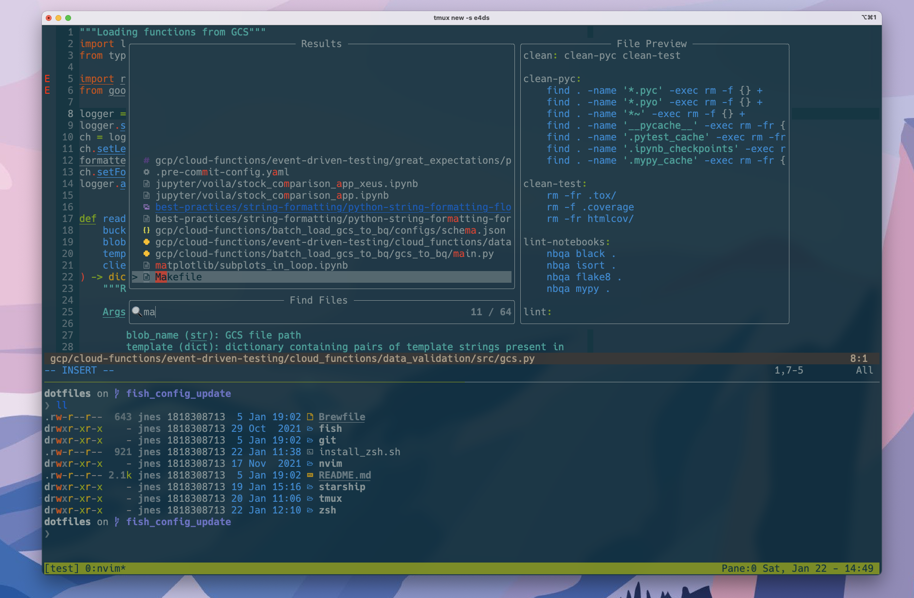

# Dotfiles

Dotfile Configurations 



Currently using n(eo)vim and zsh as main editor/terminal combo and using the [Starship prompt](https://starship.rs/).

## Context

The configurations in this repository are unlikely to be suitable for every developer. 

I don't recommend you blindly install/overwrite your current configurations with this files. Instead, read the config files and take the bits you like, line by line.

I am a ML Engineer primarily working with Python and using cloud providers such as GCP and AWS. These dotfiles reflect my daily Python workflow working in zsh + tmux + neovim from the command line.

I use `pyenv` for Python version and virtual environment management and [FZF](https://github.com/junegunn/fzf) for fuzzy finding on the command line.

## NeoVim Setup 
  
- [vim-plug](https://github.com/junegunn/vim-plug) - A minimalist Vim plugin manager
- [nvim-lspconfig](https://github.com/neovim/nvim-lspconfig) - A collection of configurations for Neovim's built-in LSP
- [nvim-treesitter](https://github.com/nvim-treesitter/nvim-treesitter) - [Treesitter](https://github.com/tree-sitter/tree-sitter) configurations and abstraction layer for Neovim
- [nvim-cmp](https://github.com/hrsh7th/nvim-cmp) - A completion plugin for neovim coded in Lua
- [lspsaga.nvim](https://github.com/tami5/lspsaga.nvim) - A light-weight LSP plugin based on Neovim built-in LSP with highly a performant UI
- [telescope.nvim](https://github.com/nvim-telescope/telescope.nvim) - A highly extendable fuzzy finder over lists
- [NeoSolarized color scheme](https://github.com/overcache/NeoSolarized)

## Oh-my-ZSH

- [Starship (prompt)](https://starship.rs/) - Minimal cross-shell prompt (see starship.toml for config)
- [zsh-syntax-highlighting](https://github.com/zsh-users/zsh-syntax-highlighting)
- [zsh-autocomplete](https://github.com/marlonrichert/zsh-autocomplete)
- [Nerd fonts](https://github.com/ryanoasis/nerd-fonts) - Powerline-patched fonts. I use Hack.
- [Exa](https://the.exa.website/) - `ls` replacement
- [z-zsh](https://github.com/agkozak/zsh-z) -- Directory jumping
- [vi-mode](https://github.com/ohmyzsh/ohmyzsh/tree/master/plugins/vi-mode) - Vim keybindings on the command line

## Fish

Fish shell and prompt is basically set up exactly the same as oh-my-zsh

- [Fish shell](https://fishshell.com/) - shell with great out-of-the-box functionality (syntax highlighting and autocomplete)
- [Starship (prompt)](https://starship.rs/) - Minimal cross-shell prompt (see starship.toml for config)
- [Fisher](https://github.com/jorgebucaran/fisher) - Plugin manager
- [z for fish](https://github.com/jethrokuan/z) - Directory jumping
- [Exa](https://the.exa.website/) - `ls` replacement


---

## How to Use (MacOS)

### Clone Repo

```
git clone https://github.com/julian-west/dotfiles.git
```

### Install Homebrew

```shell
/bin/bash -c "$(curl -fsSL https://raw.githubusercontent.com/Homebrew/install/HEAD/install.sh)"
```

**Install command line programs in the Brewfile**

> Caution: don't blindy install everything. Better approach to use a more minimal brewfile

**Note: The Brewfile does not support version lock syntax and will download the latest version of each package.**

```
brew bundle
```
### Install FZF

FZF is a command line fuzzy file finder

I download and install FZF directly from `git`

```shell
git clone --depth 1 https://github.com/junegunn/fzf.git ~/.fzf
~/.fzf/install
```


### Install zsh

Install `zsh`, install plugins and set as primary shell using the following script:

```
bash install_zsh.sh
```

### Install Neovim

```shell
# install neovim from Homebrew
brew install neovim
```
**Install language-server for LSP**

I mainly use Python for development and use [pyright](https://github.com/microsoft/pyright) as my language server. In order for the LSP to work you need to install globally `pyright` and also install `pyright` and `neovim` into your Python virtual environment.

```
# install pyright
npm install -g pyright
```

```
# install into your Python virtual environment
pip install pyright neovim
```

**Install vim-plug**

I use [vim-plug](https://github.com/junegunn/vim-plug) to manage and install neovim plugins.

Install using the following command (from the documentation)

```shell
sh -c 'curl -fLo "${XDG_DATA_HOME:-$HOME/.local/share}"/nvim/site/autoload/plug.vim --create-dirs \
       https://raw.githubusercontent.com/junegunn/vim-plug/master/plug.vim'
```

**Install plugins**

Open the `init.vim` file in neovim and install the plugins using `:PlugInstall` 

### Build symlinks

Symlink dotfiles configurations to the dotfiles in the $HOME directory using stow

I have organised the directory structure so you can pick and choose which configs you wish to use. You can create symlinks using [stow](https://www.gnu.org/software/stow/)

```
# create symlinks between dotfiles and master configs
# e.g. create symlink for tmux config only
stow tmux

# or stow all folders
stow tmux zsh nvim fish git starship
```

Note: make sure you 'source' each dotfile to make sure changes have been made

## Limitations

Automation and configurations mainly aimed at MacOS. Need to test and debug for linux distros.

Brewfile contains the kitchen sink -- might make a more 'minimal' version in the future. Don't blindly install everything as it is probably not all needed

## Resources

These dotfile configuration have been heavily inspired by the following resources. I highly recommend you check them out:
- [Devsalife dotfiles + YouTube channel](https://github.com/craftzdog/dotfiles-public)
- [Chris Toomey - Tmux Course](https://thoughtbot.com/upcase/tmux)

